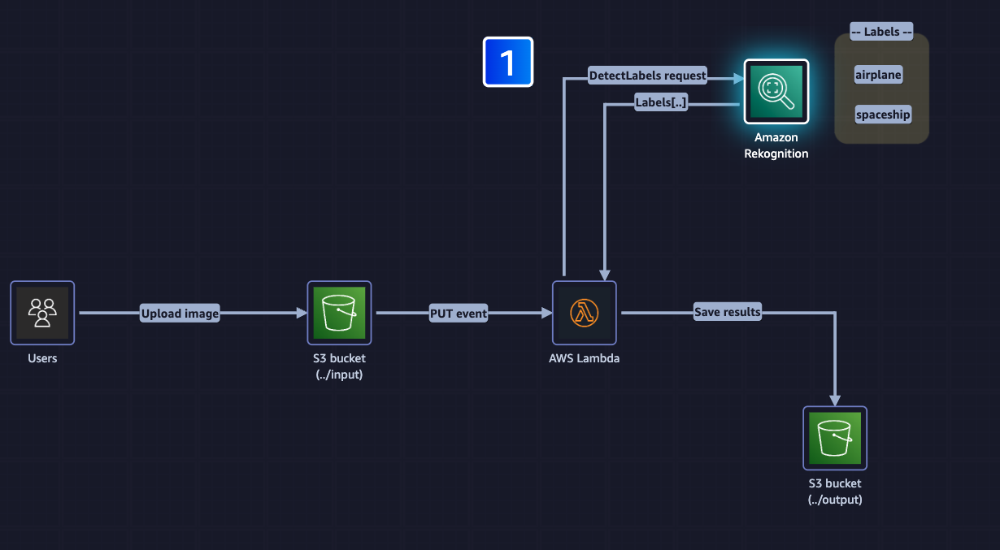

# AWS Rekognition Image Analysis

This project demonstrates how to use AWS Rekognition to analyze images stored in Amazon S3 buckets. The implementation uses a Lambda function that is triggered when an image is uploaded to an S3 bucket.



## Overview

The project includes a Python script that:

1. Gets triggered when an image is uploaded to an S3 bucket
2. Uses AWS Rekognition to detect labels in the image
3. Checks if a specific label is present in the detected labels
4. Writes the analysis results back to the S3 bucket

## Prerequisites

- AWS Account
- Configured AWS CLI with appropriate permissions
- Python 3.x
- Boto3 library
- S3 bucket for image storage

## Setup

1. Create an S3 bucket with input/ and output/ folders
2. Set up a Lambda function using the provided Python code
3. Configure S3 event notifications to trigger the Lambda function when an image is uploaded
4. Update the `LABEL` variable in the script with your target label

## Usage

1. Upload an image to the input/ folder in your S3 bucket
2. The Lambda function will automatically:
   - Analyze the image using Rekognition
   - Detect labels
   - Check if your specified label is present
   - Save the results to output/rekognition_response.json

## Lambda Function

The [`rekognition_from_s3.py`](rekognition_from_s3.py) script handles:

- Getting the S3 bucket and object information from the trigger event
- Calling the AWS Rekognition service to detect labels
- Processing the response to check for the specified label
- Saving the results back to S3

## Testing

You can test the Lambda function using the following event structure:

```json
{
  "Records": [
    {
      "s3": {
        "bucket": {
          "name": "<Your_bucket_name>"
        },
        "object": {
          "key": "input/your-image.png"
        }
      }
    }
  ]
}
```

## Resources

- [AWS Rekognition Documentation](https://docs.aws.amazon.com/rekognition/latest/dg/what-is.html)
- [Boto3 Rekognition Client](https://boto3.amazonaws.com/v1/documentation/api/latest/reference/services/rekognition.html)
- [AWS Lambda Documentation](https://docs.aws.amazon.com/lambda/latest/dg/welcome.html)
